# Polyglot Codebase Knowledge Graph

> Generated offline by **readmenator**. Supports C, C++, Python, Go, Rust, JS/TS, Java, C#, Shell, PHP, Dart, GDScript, Nim, ASM.
> No LLMs. No tokens. Pure static analysis.

**Total Files Parsed:** 4 | **Total Symbols Extracted:** 33 | **Total Imports:** 14

## Structural Knowledge Map

```mermaid
graph TD
    classDef mod fill:#1e1e1e,stroke:#ff6666,stroke-width:2px,color:#fff;
    classDef cls fill:#2d2d2d,stroke:#4ec9b0,stroke-width:2px,color:#fff;
    classDef fn fill:#333,stroke:#dcdcaa,stroke-width:1px,color:#dcdcaa;
    classDef ext fill:#111,stroke:#666,stroke-dasharray: 5 5,color:#aaa;
    main_c["main.c (c)"]
    class main_c mod;
    main_c__BASE_RELOCATION_ENTRY["_BASE_RELOCATION_ENTRY"]
    class main_c__BASE_RELOCATION_ENTRY cls;
    main_c --> main_c__BASE_RELOCATION_ENTRY
    main_c_hookGetCommandLineW["hookGetCommandLineW"]
    class main_c_hookGetCommandLineW fn;
    main_c --> main_c_hookGetCommandLineW
    main_c_hookGetCommandLineA["hookGetCommandLineA"]
    class main_c_hookGetCommandLineA fn;
    main_c --> main_c_hookGetCommandLineA
    main_c_hook__p___argv["hook__p___argv"]
    class main_c_hook__p___argv fn;
    main_c --> main_c_hook__p___argv
    main_c_hook__p___wargv["hook__p___wargv"]
    class main_c_hook__p___wargv fn;
    main_c --> main_c_hook__p___wargv
    aes_py["aes.py (py)"]
    class aes_py mod;
    aes_py_AESencrypt["AESencrypt"]
    class aes_py_AESencrypt fn;
    aes_py --> aes_py_AESencrypt
    aes_py_dropFile["dropFile"]
    class aes_py_dropFile fn;
    aes_py --> aes_py_dropFile
    app_py["app.py (py)"]
    class app_py mod;
    install_sh["install.sh (sh)"]
    class install_sh mod;
    ext_sys["sys"]
    class ext_sys ext;
    aes_py -.->|imports| ext_sys
    ext_Crypto_Cipher["Crypto.Cipher"]
    class ext_Crypto_Cipher ext;
    aes_py -.->|imports| ext_Crypto_Cipher
    ext_Crypto_Util_Padding["Crypto.Util.Padding"]
    class ext_Crypto_Util_Padding ext;
    aes_py -.->|imports| ext_Crypto_Util_Padding
    ext_os["os"]
    class ext_os ext;
    aes_py -.->|imports| ext_os
    ext_hashlib["hashlib"]
    class ext_hashlib ext;
    aes_py -.->|imports| ext_hashlib
    app_py -.->|imports| ext_os
    ext_windows_h["windows.h"]
    class ext_windows_h ext;
    main_c -.->|imports| ext_windows_h
    ext_stdio_h["stdio.h"]
    class ext_stdio_h ext;
    main_c -.->|imports| ext_stdio_h
    ext_psapi_h["psapi.h"]
    class ext_psapi_h ext;
    main_c -.->|imports| ext_psapi_h
    ext_winternl_h["winternl.h"]
    class ext_winternl_h ext;
    main_c -.->|imports| ext_winternl_h
    ext_winhttp_h["winhttp.h"]
    class ext_winhttp_h ext;
    main_c -.->|imports| ext_winhttp_h
    ext_wincrypt_h["wincrypt.h"]
    class ext_wincrypt_h ext;
    main_c -.->|imports| ext_wincrypt_h
    ext_stdlib_h["stdlib.h"]
    class ext_stdlib_h ext;
    main_c -.->|imports| ext_stdlib_h
    ext_string_h["string.h"]
    class ext_string_h ext;
    main_c -.->|imports| ext_string_h
```

---

## Architecture Reference

### C (1 files)

#### `main.c`
**Path:** `main.c`

**Functions:**
- `hookGetCommandLineW` (line 106) - *Implementación de hooks*
- `hookGetCommandLineA` (line 107)
- `hook__p___argv` (line 108)
- `hook__p___wargv` (line 109)
- `hook__p___argc` (line 110)
- `anti_analysis` (line 115) - *=== ANTI-ANALYSIS ===*
- `selfDestruct` (line 139)
- `hook__wgetmainargs` (line 195)
- `hook__getmainargs` (line 201)
- `hookexit` (line 207)
- `hookExitProcess` (line 212)
- `masqueradeCmdline` (line 216)
- `freeargvA` (line 254)
- `freeargvW` (line 262)
- `GetNTHeaders` (line 270)
- `GetPEDirectory` (line 282)
- `RepairIAT` (line 292)
- `_stricmp` (line 347)
- `RunPE` (line 367)
- `PELoader` (line 373)
- `getNtdll` (line 447)
- `Unhook` (line 490)
- `DecryptAES` (line 526)
- `GetData` (line 559)
- `main` (line 661)

**Macros:**
- `_CRT_RAND_S` (line 35)
- `NT_SUCCESS` (line 46)
- `NtCurrentThread` (line 48)
- `NtCurrentProcess` (line 50)
- `_CRT_SECURE_NO_WARNINGS` (line 53)

**Structs:**
- `_BASE_RELOCATION_ENTRY` (line 57)

### PY (2 files)

#### `aes.py`
**Path:** `aes.py`

**Functions:**
- `AESencrypt` (line 7)
- `dropFile` (line 15)

#### `app.py`
**Path:** `app.py`

*No symbols extracted*

### SH (1 files)

#### `install.sh`
**Path:** `install.sh`

*No symbols extracted*
