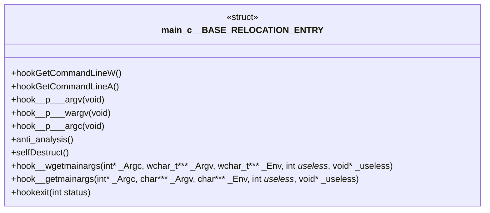

# Polyglot Codebase Knowledge Graph

> Generated offline by **readmenator**. Supports C, C++, Python, Go, Rust, JS/TS, Java, C#, Shell, PHP, Dart, GDScript, Nim, ASM, Ruby, Swift, Kotlin, Scala, Lua, Elixir.
> No LLMs. No tokens. Pure static analysis. See more [here](https://github.com/grisuno/ReadMenator)

**Total Files Parsed:** 4 | **Total Symbols Extracted:** 33 | **Total Imports:** 14

<!-- ranking_model: v1.0 | weights: {ppr:0.45,auth:0.2,test:0.15,doc:0.1,fresh:0.1} | alpha:0.85 | commit:4c8e0d2 | date:2026-07-18 -->


## Table of Contents

1. [Statistics Dashboard](#statistics-dashboard)
2. [Architectural Layers](#architectural-layers)
3. [Ranked Context](#ranked-context)
4. [God Nodes](#god-nodes)
5. [Suggested Questions](#suggested-questions)
6. [Hotspot Analysis](#hotspot-analysis)
7. [Change Impact Analysis](#change-impact-analysis)
8. [Suggested Linting Rules](#suggested-linting-rules)
9. [Orphans](#orphans)
10. [Query Recipes](#query-recipes)
11. [Structural Knowledge Map](#structural-knowledge-map)
12. [UML Class Diagram](#uml-class-diagram)
13. [Code Property Graph](#code-property-graph)
14. [Architecture Reference](#architecture-reference)
    - [C (1 files)](#c-1-files)
    - [PY (2 files)](#py-2-files)
    - [SH (1 files)](#sh-1-files)

---

## Statistics Dashboard

| Metric | Value |
|--------|-------|
| Total Files | 4 |
| Total Symbols | 33 |
| Total Imports | 14 |
| Call Edges | 9 |
| Inheritance Edges | 0 |
| Languages | 3 |
| Avg Symbols/File | 8.2 |
| Avg Imports/File | 3.5 |

### Top Files by Import Count (Fan-Out)

| File | Imports | Symbols | Language |
|------|---------|---------|----------|
| `main.c` | 8 | 31 | c |
| `aes.py` | 5 | 2 | py |
| `app.py` | 1 | 0 | py |

---

## Architectural Layers

Auto-detected from path patterns, naming conventions, and imported frameworks.

| Layer | Files |
|-------|-------|
| utility | 4 |

### utility

- `aes.py` (py, 2 symbols)
- `app.py` (py, 0 symbols)
- `install.sh` (sh, 0 symbols)
- `main.c` (c, 31 symbols)

---

## Ranked Context

Files ranked by composite score for the current query context. The ranking combines Personalized PageRank (query relevance), global authority, test coverage, documentation coverage, and code freshness. Model: v1.0.

| Rank | File | Composite | PPR | Authority | Test | Doc |
|------|------|-----------|-----|-----------|------|-----|
| 1 | `app.py` | 0.1000 | 0.0000 | 0.0000 | 0.00 | 1.00 |
| 2 | `main.c` | 0.0065 | 0.0000 | 0.0000 | 0.00 | 0.06 |
| 3 | `aes.py` | 0.0000 | 0.0000 | 0.0000 | 0.00 | 0.00 |
| 4 | `install.sh` | 0.0000 | 0.0000 | 0.0000 | 0.00 | 0.00 |

---

## God Nodes

Most architecturally central files ranked by combined import/export degree and symbol richness.

| File | Score | Connections | PageRank |
|------|-------|-------------|----------|
| `main.c` | 3.1 | | 0.0000 |
| `aes.py` | 0.2 | | 0.0000 |
| `app.py` | 0.0 | | 0.0000 |
| `install.sh` | 0.0 | | 0.0000 |

---

## Suggested Questions

Auto-generated exploration prompts based on graph structure:

- What does main.c depend on, and what depends on it? (0 connections)
- What does aes.py depend on, and what depends on it? (0 connections)
- What does app.py depend on, and what depends on it? (0 connections)
- What is _BASE_RELOCATION_ENTRY in main.c and how is it used?
- What is the overall architecture of this codebase?

---

## Hotspot Analysis

Files ranked by combined complexity (symbol count) and centrality (connection count). High-scoring files are architecturally critical and may need refactoring attention.

| File | Complexity | Centrality | Combined | Symbols | Connections |
|------|-----------|------------|----------|---------|-------------|
| `app.py` | 0.000 | 0.125 | 0.075 | 0 | 1 |
| `main.c` | 1.000 | 1.000 | 1.000 | 31 | 8 |
| `aes.py` | 0.065 | 0.625 | 0.401 | 2 | 5 |
| `install.sh` | 0.000 | 0.000 | 0.000 | 0 | 0 |

---

## Change Impact Analysis

Files sorted by how many other files would be affected if they changed. High-impact files should be changed with caution.

| File | Direct Dependents | Transitive Dependents | Total Impact |
|------|------------------|----------------------|--------------|
| `aes.py` | 0 | 0 | 0 |
| `app.py` | 0 | 0 | 0 |
| `install.sh` | 0 | 0 | 0 |
| `main.c` | 0 | 0 | 0 |

---

## Suggested Linting Rules

Automatically suggested linting and security rules based on patterns detected in the codebase. These can be exported as Semgrep rules using the `--export-rules` flag.

| Rule ID | Severity | Description | Language | Matches |
|---------|----------|-------------|----------|---------|
| `RM001` | info | Large number of functions in c: 25 total | c | 25 |

---

## Orphans

Files with no documentation or low connectivity. These are candidates for documentation investment or cleanup.

- `aes.py` (2 symbols, no doc)
- `install.sh` (0 symbols, no doc)

---

## Query Recipes

Example queries you can run against this knowledge base using the ranking engine:

```
# Find files most relevant to a concept
readmenator query "Where is the import resolver implemented?"

# Rank files by relevance to a topic
readmenator query "How does documentation generation work?"

# Explain why a file ranks highly
readmenator query "explain readmenator/_documentation.py"

# Trace dependency paths with ranked context
readmenator query "path from CLI to exporter"
```

The ranking model uses the following signals:

- **Personalized PageRank** (45% weight): query-specific relevance via seed propagation
- **Global Authority** (20% weight): structural importance via standard PageRank
- **Test Coverage** (15% weight): fraction of symbols referenced in test files
- **Doc Coverage** (10% weight): presence of docstrings and file-level docs
- **Freshness** (10% weight): recent modification activity

Results include score decomposition and justification paths for each ranked item.

---

## Structural Knowledge Map

```mermaid
graph TD
    classDef mod fill:#1e1e1e,stroke:#ff6666,stroke-width:2px,color:#fff;
    classDef cls fill:#2d2d2d,stroke:#4ec9b0,stroke-width:2px,color:#fff;
    classDef fn fill:#333,stroke:#dcdcaa,stroke-width:1px,color:#dcdcaa;
    classDef ext fill:#111,stroke:#666,stroke-dasharray:5 5,color:#aaa;
    main_c["main.c (c)"]
    class main_c mod;
    main_c__BASE_RELOCATION_ENTRY["_BASE_RELOCATION_ENTRY"]
    class main_c__BASE_RELOCATION_ENTRY cls;
    main_c --> main_c__BASE_RELOCATION_ENTRY
    main_c_hookGetCommandLineW["hookGetCommandLineW"]
    class main_c_hookGetCommandLineW fn;
    main_c --> main_c_hookGetCommandLineW
    main_c_hookGetCommandLineA["hookGetCommandLineA"]
    class main_c_hookGetCommandLineA fn;
    main_c --> main_c_hookGetCommandLineA
    main_c_hook__p___argv["hook__p___argv"]
    class main_c_hook__p___argv fn;
    main_c --> main_c_hook__p___argv
    main_c_hook__p___wargv["hook__p___wargv"]
    class main_c_hook__p___wargv fn;
    main_c --> main_c_hook__p___wargv
    aes_py["aes.py (py)"]
    class aes_py mod;
    app_py["app.py (py)"]
    class app_py mod;
    install_sh["install.sh (sh)"]
    class install_sh mod;
    ext_sys["sys"]
    class ext_sys ext;
    aes_py -.->|imports| ext_sys
    ext_Crypto_Cipher["Crypto.Cipher"]
    class ext_Crypto_Cipher ext;
    aes_py -.->|imports| ext_Crypto_Cipher
    ext_Crypto_Util_Padding["Crypto.Util.Padding"]
    class ext_Crypto_Util_Padding ext;
    aes_py -.->|imports| ext_Crypto_Util_Padding
    ext_os["os"]
    class ext_os ext;
    aes_py -.->|imports| ext_os
    ext_hashlib["hashlib"]
    class ext_hashlib ext;
    aes_py -.->|imports| ext_hashlib
    app_py -.->|imports| ext_os
    ext_windows_h["windows.h"]
    class ext_windows_h ext;
    main_c -.->|imports| ext_windows_h
    ext_stdio_h["stdio.h"]
    class ext_stdio_h ext;
    main_c -.->|imports| ext_stdio_h
    ext_psapi_h["psapi.h"]
    class ext_psapi_h ext;
    main_c -.->|imports| ext_psapi_h
    ext_winternl_h["winternl.h"]
    class ext_winternl_h ext;
    main_c -.->|imports| ext_winternl_h
    ext_winhttp_h["winhttp.h"]
    class ext_winhttp_h ext;
    main_c -.->|imports| ext_winhttp_h
    ext_wincrypt_h["wincrypt.h"]
    class ext_wincrypt_h ext;
    main_c -.->|imports| ext_wincrypt_h
    ext_stdlib_h["stdlib.h"]
    class ext_stdlib_h ext;
    main_c -.->|imports| ext_stdlib_h
    ext_string_h["string.h"]
    class ext_string_h ext;
    main_c -.->|imports| ext_string_h
```



---

## UML Class Diagram

Auto-generated Mermaid class diagram from parsed class-level symbols. Shows classes, structs, interfaces, traits, and their methods with inheritance and dependency relationships.



---

## Code Property Graph

Machine-readable Code Property Graph (CPG) in JSON-LD format. This block allows AI agents to parse the full structural graph without additional file reads. Compatible with GraphRAG pipelines.

```json
{"@context": "https://schema.org", "analysis": {"communities": [], "god_nodes": [{"node_id": "main.c", "score": 3.1}, {"node_id": "aes.py", "score": 0.2}, {"node_id": "app.py", "score": 0.0}, {"node_id": "install.sh", "score": 0.0}], "surprising_connections": []}, "edges": [{"confidence": "EXTRACTED", "relation": "imports", "source": "aes.py", "target": "sys"}, {"confidence": "EXTRACTED", "relation": "imports", "source": "aes.py", "target": "Crypto.Cipher"}, {"confidence": "EXTRACTED", "relation": "imports", "source": "aes.py", "target": "Crypto.Util.Padding"}, {"confidence": "EXTRACTED", "relation": "imports", "source": "aes.py", "target": "os"}, {"confidence": "EXTRACTED", "relation": "imports", "source": "aes.py", "target": "hashlib"}, {"confidence": "EXTRACTED", "relation": "imports", "source": "app.py", "target": "os"}, {"confidence": "EXTRACTED", "relation": "imports", "source": "main.c", "target": "windows.h"}, {"confidence": "EXTRACTED", "relation": "imports", "source": "main.c", "target": "stdio.h"}, {"confidence": "EXTRACTED", "relation": "imports", "source": "main.c", "target": "psapi.h"}, {"confidence": "EXTRACTED", "relation": "imports", "source": "main.c", "target": "winternl.h"}, {"confidence": "EXTRACTED", "relation": "imports", "source": "main.c", "target": "winhttp.h"}, {"confidence": "EXTRACTED", "relation": "imports", "source": "main.c", "target": "wincrypt.h"}, {"confidence": "EXTRACTED", "relation": "imports", "source": "main.c", "target": "stdlib.h"}, {"confidence": "EXTRACTED", "relation": "imports", "source": "main.c", "target": "string.h"}], "generator": "readmenator", "metadata": {"edge_count": 23, "file_count": 4, "language_count": 3, "symbol_count": 33}, "nodes": [{"id": "aes.py", "kind": "module", "label": "aes.py", "language": "py", "sha256": "b1a091c0d2d22716", "symbol_count": 2, "symbols": [{"kind": "function", "line": 7, "name": "AESencrypt", "signature": "def AESencrypt(plaintext, key)"}, {"kind": "function", "line": 15, "name": "dropFile", "signature": "def dropFile(key, ciphertext)"}]}, {"doc": "_*_ coding: utf8 _*_", "id": "app.py", "kind": "module", "label": "app.py", "language": "py", "sha256": "57b21bdb023585b8", "symbol_count": 0, "symbols": []}, {"id": "install.sh", "kind": "module", "label": "install.sh", "language": "sh", "sha256": "c907d80fd6734993", "symbol_count": 0, "symbols": []}, {"id": "main.c", "kind": "module", "label": "main.c", "language": "c", "sha256": "f7daf2fcd46c5fe5", "symbol_count": 31, "symbols": [{"kind": "struct", "line": 57, "name": "_BASE_RELOCATION_ENTRY"}, {"doc": "Implementación de hooks", "kind": "function", "line": 106, "name": "hookGetCommandLineW", "signature": "LPWSTR hookGetCommandLineW()"}, {"kind": "function", "line": 107, "name": "hookGetCommandLineA", "signature": "LPSTR hookGetCommandLineA()"}, {"kind": "function", "line": 108, "name": "hook__p___argv", "signature": "char*** __cdecl hook__p___argv(void)"}, {"kind": "function", "line": 109, "name": "hook__p___wargv", "signature": "wchar_t*** __cdecl hook__p___wargv(void)"}, {"kind": "function", "line": 110, "name": "hook__p___argc", "signature": "int* __cdecl hook__p___argc(void)"}, {"doc": "=== ANTI-ANALYSIS ===", "kind": "function", "line": 115, "name": "anti_analysis", "signature": "BOOL anti_analysis()"}, {"kind": "function", "line": 139, "name": "selfDestruct", "signature": "void selfDestruct()"}, {"kind": "function", "line": 195, "name": "hook__wgetmainargs", "signature": "int hook__wgetmainargs(int* _Argc, wchar_t*** _Argv, wchar_t*** _Env, int _useless_, void* _useless)"}, {"kind": "function", "line": 201, "name": "hook__getmainargs", "signature": "int hook__getmainargs(int* _Argc, char*** _Argv, char*** _Env, int _useless_, void* _useless)"}, {"kind": "function", "line": 207, "name": "hookexit", "signature": "int __cdecl hookexit(int status)"}, {"kind": "function", "line": 212, "name": "hookExitProcess", "signature": "void __stdcall hookExitProcess(UINT statuscode)"}, {"kind": "function", "line": 216, "name": "masqueradeCmdline", "signature": "void masqueradeCmdline()"}, {"kind": "function", "line": 254, "name": "freeargvA", "signature": "void freeargvA(char** array, int Argc)"}, {"kind": "function", "line": 262, "name": "freeargvW", "signature": "void freeargvW(wchar_t** array, int Argc)"}, {"kind": "function", "line": 270, "name": "GetNTHeaders", "signature": "char* GetNTHeaders(char* pe_buffer)"}, {"kind": "function", "line": 282, "name": "GetPEDirectory", "signature": "IMAGE_DATA_DIRECTORY* GetPEDirectory(PVOID pe_buffer, size_t dir_id)"}, {"kind": "function", "line": 292, "name": "RepairIAT", "signature": "BOOL RepairIAT(PVOID modulePtr)"}, {"kind": "function", "line": 347, "name": "_stricmp", "signature": "_stricmp(func_name, \"exit\") == 0 ||\n                    _stricmp(func_name, \"_Exit\") == 0 ||\n    ..."}, {"kind": "function", "line": 367, "name": "RunPE", "signature": "DWORD WINAPI RunPE(LPVOID lpParameter)"}, {"kind": "function", "line": 373, "name": "PELoader", "signature": "void PELoader(char* data, DWORD datasize)"}, {"kind": "function", "line": 447, "name": "getNtdll", "signature": "LPVOID getNtdll()"}, {"kind": "function", "line": 490, "name": "Unhook", "signature": "BOOL Unhook(LPVOID cleanNtdll)"}, {"kind": "function", "line": 526, "name": "DecryptAES", "signature": "void DecryptAES(char* shellcode, DWORD shellcodeLen, char* key, DWORD keyLen)"}, {"kind": "function", "line": 559, "name": "GetData", "signature": "DATA GetData(wchar_t* whost, DWORD port, wchar_t* wresource)"}, {"kind": "function", "line": 661, "name": "main", "signature": "int main(int argc, char** argv)"}, {"kind": "macro", "line": 35, "name": "_CRT_RAND_S"}, {"kind": "macro", "line": 46, "name": "NT_SUCCESS"}, {"kind": "macro", "line": 48, "name": "NtCurrentThread"}, {"kind": "macro", "line": 50, "name": "NtCurrentProcess"}, {"kind": "macro", "line": 53, "name": "_CRT_SECURE_NO_WARNINGS"}]}], "type": "CodePropertyGraph", "version": "1.0"}
```

---

## Architecture Reference

### C (1 files)

#### `main.c`
**Path:** `main.c`

**Functions:**
- `hookGetCommandLineW` (line 106) `LPWSTR hookGetCommandLineW()` - *Implementación de hooks*
- `hookGetCommandLineA` (line 107) `LPSTR hookGetCommandLineA()`
- `hook__p___argv` (line 108) `char*** __cdecl hook__p___argv(void)`
- `hook__p___wargv` (line 109) `wchar_t*** __cdecl hook__p___wargv(void)`
- `hook__p___argc` (line 110) `int* __cdecl hook__p___argc(void)`
- `anti_analysis` (line 115) `BOOL anti_analysis()` - *=== ANTI-ANALYSIS ===*
- `selfDestruct` (line 139) `void selfDestruct()`
- `hook__wgetmainargs` (line 195) `int hook__wgetmainargs(int* _Argc, wchar_t*** _Argv, wchar_t*** _Env, int _useless_, void* _useless)`
- `hook__getmainargs` (line 201) `int hook__getmainargs(int* _Argc, char*** _Argv, char*** _Env, int _useless_, void* _useless)`
- `hookexit` (line 207) `int __cdecl hookexit(int status)`
- `hookExitProcess` (line 212) `void __stdcall hookExitProcess(UINT statuscode)`
- `masqueradeCmdline` (line 216) `void masqueradeCmdline()`
- `freeargvA` (line 254) `void freeargvA(char** array, int Argc)`
- `freeargvW` (line 262) `void freeargvW(wchar_t** array, int Argc)`
- `GetNTHeaders` (line 270) `char* GetNTHeaders(char* pe_buffer)`
- `GetPEDirectory` (line 282) `IMAGE_DATA_DIRECTORY* GetPEDirectory(PVOID pe_buffer, size_t dir_id)`
- `RepairIAT` (line 292) `BOOL RepairIAT(PVOID modulePtr)`
- `_stricmp` (line 347) `_stricmp(func_name, "exit") == 0 ||
                    _stricmp(func_name, "_Exit") == 0 ||
    ...`
- `RunPE` (line 367) `DWORD WINAPI RunPE(LPVOID lpParameter)`
- `PELoader` (line 373) `void PELoader(char* data, DWORD datasize)`
- `getNtdll` (line 447) `LPVOID getNtdll()`
- `Unhook` (line 490) `BOOL Unhook(LPVOID cleanNtdll)`
- `DecryptAES` (line 526) `void DecryptAES(char* shellcode, DWORD shellcodeLen, char* key, DWORD keyLen)`
- `GetData` (line 559) `DATA GetData(wchar_t* whost, DWORD port, wchar_t* wresource)`
- `main` (line 661) `int main(int argc, char** argv)`

**Macros:**
- `_CRT_RAND_S` (line 35)
- `NT_SUCCESS` (line 46)
- `NtCurrentThread` (line 48)
- `NtCurrentProcess` (line 50)
- `_CRT_SECURE_NO_WARNINGS` (line 53)

**Structs:**
- `_BASE_RELOCATION_ENTRY` (line 57)

### PY (2 files)

#### `aes.py`
**Path:** `aes.py`

**Functions:**
- `AESencrypt` (line 7) `def AESencrypt(plaintext, key)`
- `dropFile` (line 15) `def dropFile(key, ciphertext)`

#### `app.py`
**Path:** `app.py`
**File Doc:** *_*_ coding: utf8 _*_*

*No symbols extracted*

### SH (1 files)

#### `install.sh`
**Path:** `install.sh`

*No symbols extracted*
